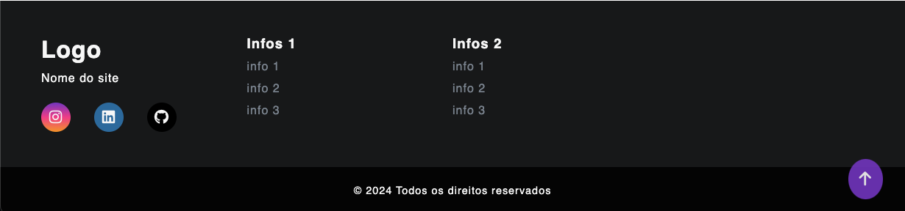
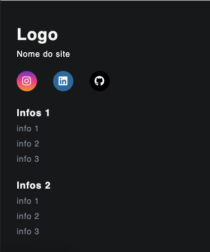

<h1 align="center">Projeto de Footer</h1>

Esse projeto foi desenvolvido especialmente para o aprendizado e especificação das tecnologias abaixo.

## Recursos:

- Footer moderno e responsivo.
- Pode ter updates conforme o necessário.

## 🛠 Tecnologias

As seguintes ferramentas foram usadas na construção do projeto:

- HTML5
- CSS3 
- JavaScript 

<h2 align="center">✅ Demonstração da aplicação</h2>

 
<h3 align="center"> Demonstração aplicada no Computador</h3>

 

<h3 align="center"> Demonstração aplicada no Smartphone</h3>

## Autor

<h3 font-weight: 900;>Feito por Kevin Bafini</h3>

